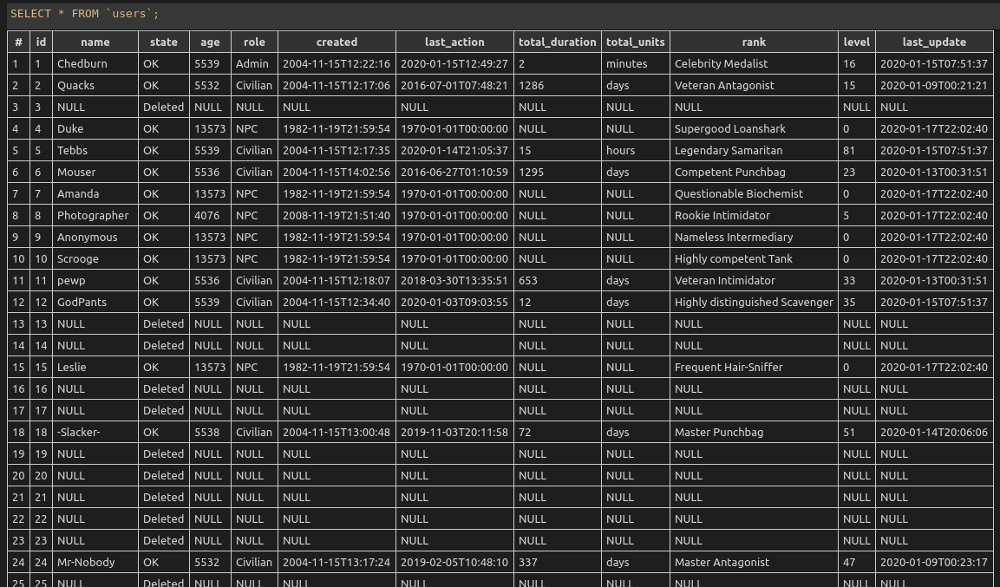

# Torn User Database

- Database Source CRLF
- migrated by JotDe

Execute ./decompress.sh before you want to migrate.
Execute ./compress.sh before you want to commit.

if you just want to work with the sqlite3-Database use

```bash
tar -xvf torn-users.db.xz
```




